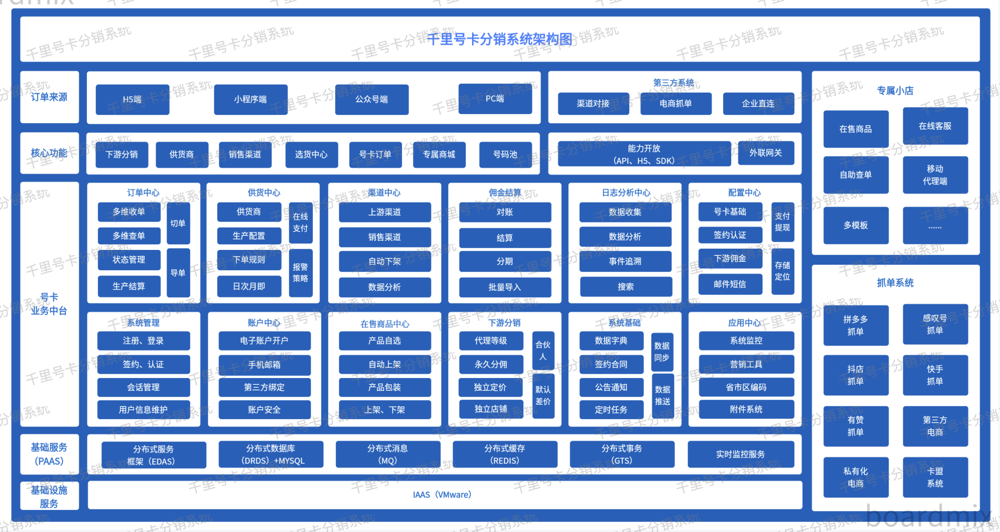
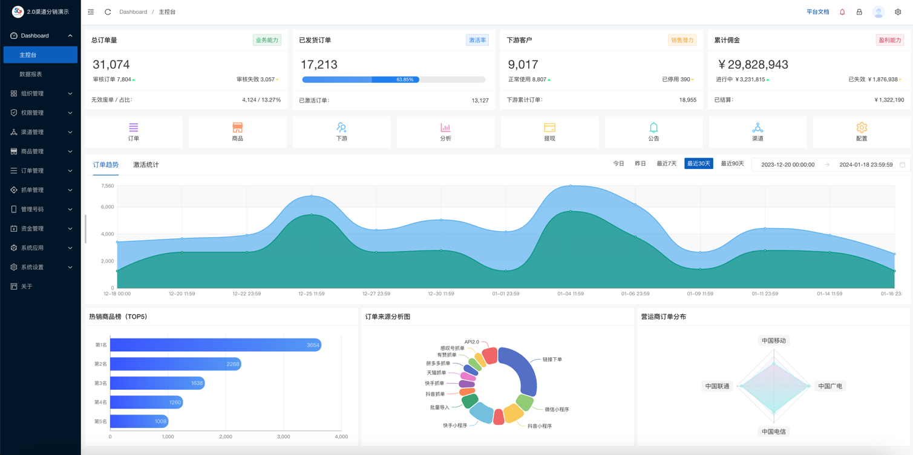
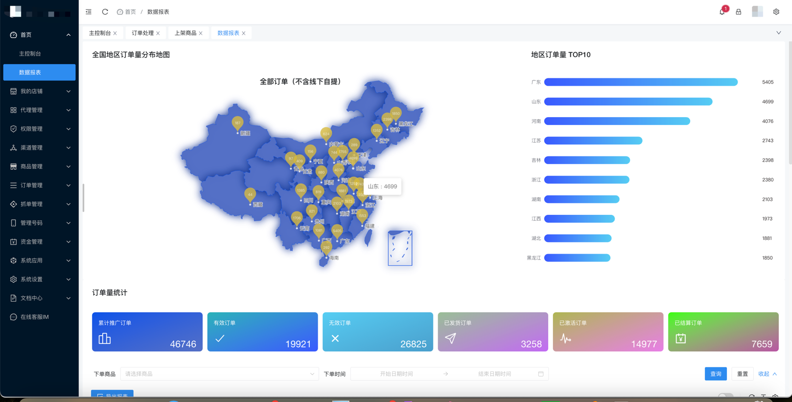
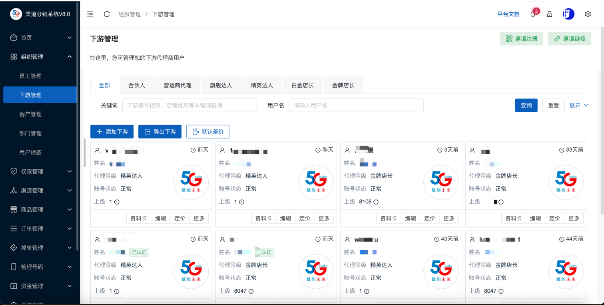
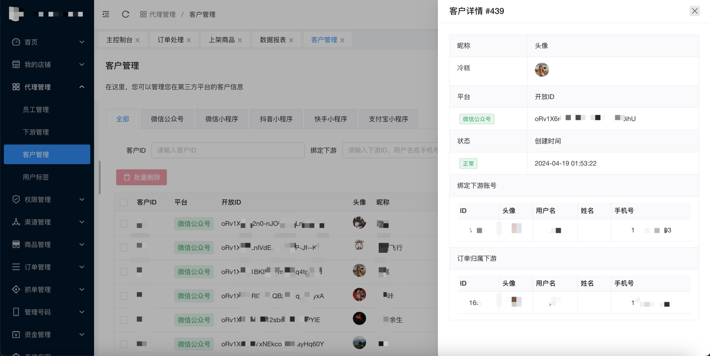
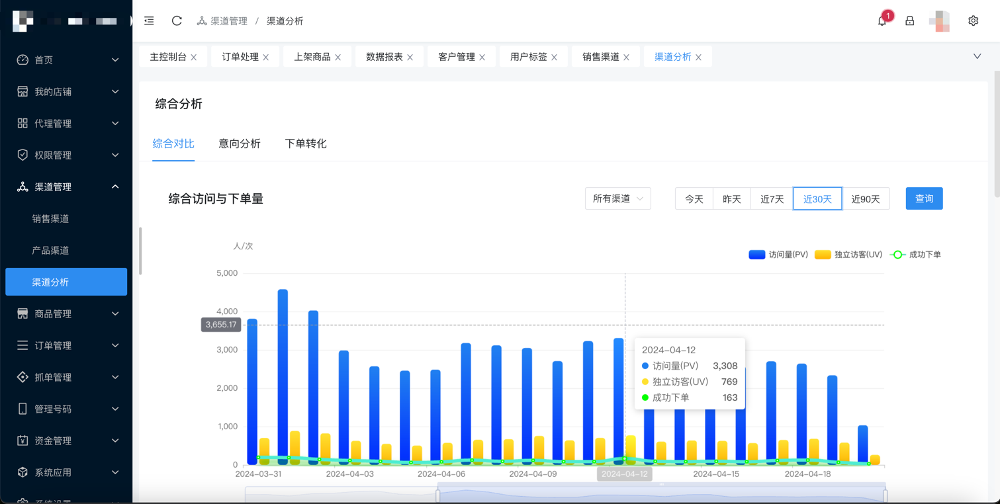
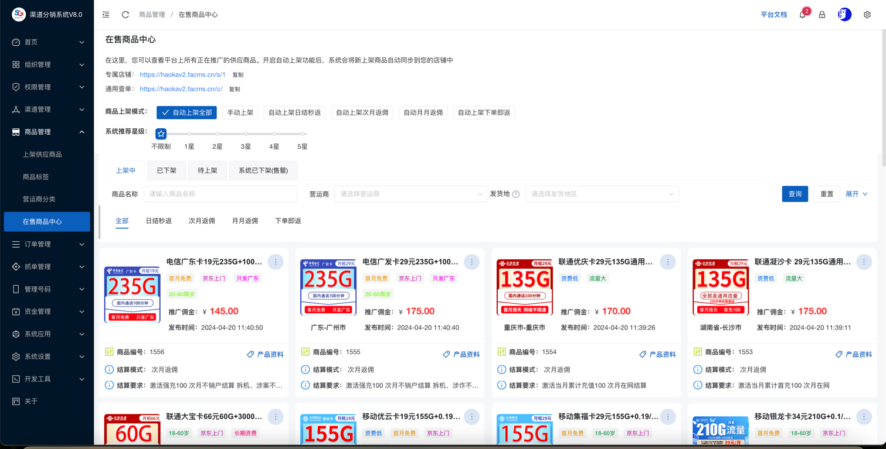
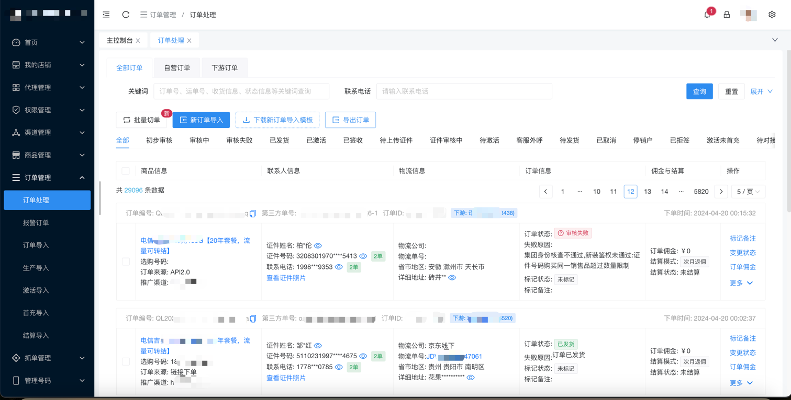
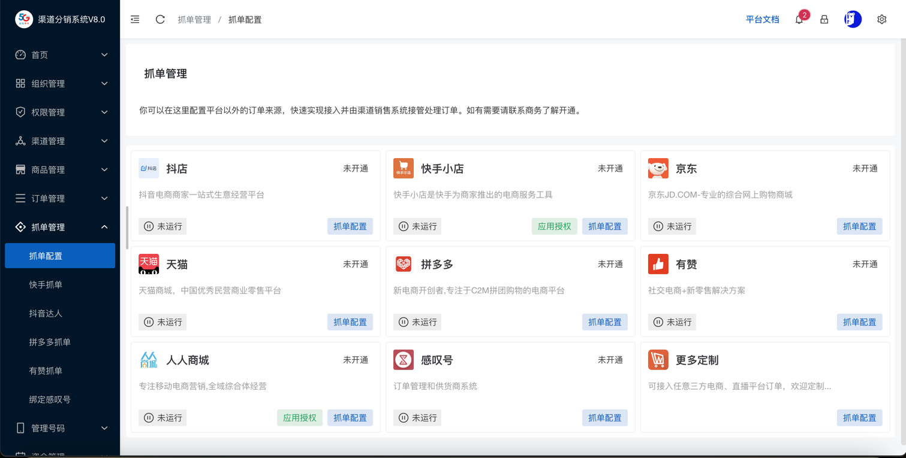
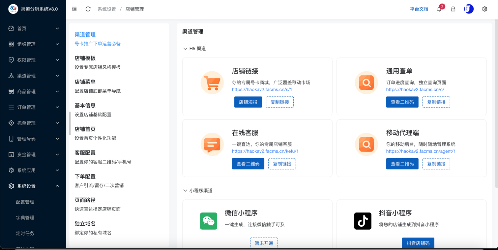

# 基本介绍

hyperf-iot基于Hyperf v2.1、VUE+Prime Pro开发的靓号系统,号卡分销系统,靓号销售系统,号卡管理系统，前后分离管理后台

## 主要特性

* 基于`Auth`验证的权限管理系统
  * 支持无限级父子级权限继承，父级的管理员可任意增删改子级管理员及权限设置
  * 支持单管理员多角色
  * 支持管理子级数据或个人数据
* 完善的前端功能组件开发
  * 基于`Prime Pro`二次开发
  * 基于`vue`开发，自适应手机、平板、PC
  * 基于`Less`进行样式开发
* 通用的会员模块和API模块
* 共用同一账号体系的Web端会员中心权限验证和API接口会员权限验证
* 整合第三方短信接口(阿里云、腾讯云短信)
* 无缝整合第三方云存储(七牛云、阿里云OSS)功能，支持云储存分片上传
* 第三方登录(QQ、微信)整合
* 第三方支付(微信、支付宝)无缝整合，微信支持PC端扫码支付

### 基于[HotGo](https://github.com/bufanyun/hotgo)开发的 企业级号卡分销系统 商业版已发布，欢迎体验

真⚡️号卡行业最早做分销系统的企业级平台，真正完善、好用的号卡系统。用产品证明价值，用实力说话：
- 我们已对接营运商及二级市场渠道超100家，对接主流抓单平台超10家，接入主流广告投放埋点超20家，已支持微信、抖音、快手、支付宝、百度等主流小程序上架，支持安卓、IOS应用商店上架。


### 商业版2.0版本演示（付费版本，购买请联系微信：15303830571）
* 演示后台：http://haokav2.demo.facms.cn/admin
* 演示移动端店铺（手机访问）：http://haokav2.demo.facms.cn/s/1
```text
超管账号：admin
密码：123456

代理商账号：huozhjh11
密码：huozhjh11

管理员（拥有上货、处理订单、代理商、内部人员相关权限）
账号：test
密码：123456

财务（处理订单、订单结算、提现处理相关权限）
账号：test_finance
密码：123456
```
- 演示站仅做基本演示，不是完整功能，请已实际搭建系统功能为准！
- 演示站数据禁止修改，前台禁止下单，所有数据均为模拟！

* 使用文档：https://v2.docs.facms.cn
* 开放API接口对接文档：https://apifox.com/apidoc/shared-1cad9662-1cd9-48af-9649-cd23d7c9be7a


### 系统架构图

- 专注于号卡系统开发和定制已经有六年的经验，能够100%支撑号卡的全生命周期管理。与全国四大运营商深度合作，运营商提供优质的产品资源，可当提供标准应用系统、标准接口为客户搭建全流程在线分销体系。




## 产品价值

| 平台价值 |                    描述                    |
|:----:|:----------------------------------------:|
| 订单系统 | 企业级订单系统，支持多维度查单、生产、结算、分析，支持一键切单、批量导单/结算  | 
| 供货中心 |   支持秒返和长期月返，支持自动生产、规则引擎、报警通知、在线支持等高级功能   | 
| 下游分销 |  自定义下游代理商等级，可单控指定代理商商品瘦小权限，批量商品定价、独立定价   | 
| 渠道中心 | 支持与四大营运商渠道接口和二级市场接口无缝对接，目前实际对接渠道已超过100+  | 
| 号码池  |    无论专属号池或线上号池，均可实现在线实时获取推荐靓号，提升下单转化率    | 
| 提现优化 | 支持多种手续费提现，支持个人\企业 普票、专票提现，支付宝一键单笔转账、批量提现 | 
| 数据分析 |  全方位多维度大数据分析订单数据、渠道数据、代理商数据，实时监控店铺运营状态   | 
| 电商抓单 |   支持主流电商平台订单同步到号卡系统生产，状态更新等，支持私有电商平台接入   | 
| 电商小店 |   下游代理均可对商品加价、包装销售，可生成专属小店推广号卡、靓号等多类产品   | 

### 商业版2.0部分功能截图展示

* 控制台
  

* 数据报表
  

* 下游代理商
  

* 多源/小程序客户管理
  

* 多维度渠道数据分析（支持广告点分析）
  

* 在售商品中心
  

* 订单处理
  

* 抓单配置
  

* 代理商店铺
  


### 商业版1.0版本（旧）

* 演示后台：http://demo.haoka.facms.cn/admin
* 演示移动端前台：http://demo.haoka.facms.cn/i/888
```
超管账号：admin
密码：123456

代理商账号：test
密码：test
```
- 演示站数据禁止修改，前台禁止下单，所有数据均为模拟！


## 以下是开源版部分页面展示

* 控制台
  

* 商品卡片
  

* 列表
  

* 编辑
  

* 系统配置
  

## 环境要求

- PHP >= 7.2
- Swoole PHP extension >= 4.5，and Disabled `Short Name`
- OpenSSL PHP extension
- JSON PHP extension
- PDO PHP extension （If you need to use MySQL Client）
- Redis PHP extension （If you need to use Redis Client）
- Protobuf PHP extension （If you need to use gRPC Server of Client）
- RabbitMQ >=3.8

## 快速开始
一、拉取代码到你已经安装好以上环境的服务器中
 ```shell script
git clone https://gitee.com/bufanyun/hyperf-iot.git && cd hyperf-iot
 ```

二、配置你的站点信息
- 将根目录下的`.env.example`名称改为.env，并配置相关信息，默认使用了redis和rabbitmq组件，所以不配置将无法正常使用！
- 服务默认使用的是9609端口，请放行防火墙端口，如需修改为其他端口请到`/config/autoload/server.php`中修改！

三、更新composer包
  ```shell script
 composer update
  ```

四、 启动服务，执行下面任意一个命令即可，首次启动会自动缓存代理配置，可能需要时间久一些
   ```shell script
  php bin/hyperf.php serve:watch  #测试调试期间用这个
  php bin/hyperf.php start  #线上用这个
   ```

五、访问测试
   ```shell script
  curl http://127.0.0.1:9609
   ```
- 如果能看到：{"code":20000,"msg":"操作成功","data":{"$method":"GET"}}则说明启动成功！

## 声明
本项目还在持续更新中，暂不公开数据结构，仅供学习参考，遇到问题请联系作者下方微信！

